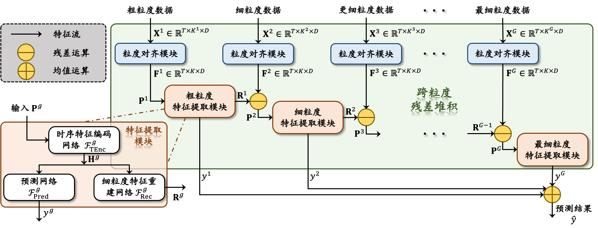
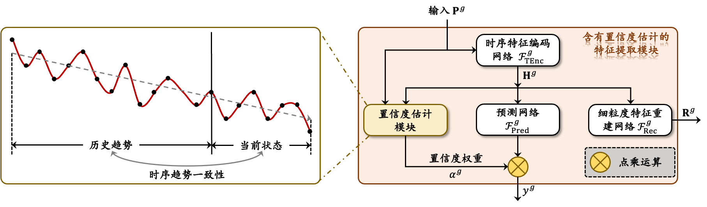

# MgRL-CE: A study of time series prediction based on Multi-granularity Residual Learning and Confidence Estimation.

> This repository provides the code for my paper "A study of time series prediction based on Multi-granularity Residual
> Learning and Confidence Estimation."

```python
MgRL-CE/
├── images # All used images of this repo.
    ├── MgRL_Framework.png # The MgRL FrameWork (without CE).
    ├── CE.png # The Confidence Estimation Module.
    ├── Elect_Data_Distribution.png # The distribution of uci electricity dataset.
    ├── MgRL_CE_Images.pptx # The raw images of MgRL_CE.
├── datasets
    ├── datasets_preprocess
        ├── elect_preprocess.py # The preprocess code of UCI electricity dataset (download from web).
        ├── lob_preprocess # The preprocess package of Future LOB dataset (downlaod from Qlib).
            ├── price_alignment_features # The paf algorithm.
            ├── lob_preprocess.py # The preprocess code of Future LOB dataset.
    ├── elect_dataset # The torch.Dataset of UCI electricity dataset (after preprocessing).
├── configs # The train&prediction config files of 3 datasets.
    ├── elect_config.py # Config file of UCI electricity dataset.
├── models # The MgRL-CE models and Comparison Methods.
    ├── MgRL.py # The Multi-Granularity Residual Learning Net: `MgRLNet` and `MgRL_CE_Net`.
    ├── comparison_methods # All comparison methods.
        ├── gru.py # The Comparison Methods 1. GRU.
    ├── loss.py # The loss function of MgRLNet and MgRL_CE_Net.
    ├── metric.py # The metrics of y_ture and y_pred.
    ├── modules.py # The modules of model.
├── train_pred_MgRL.py # Training and Prediction code of `MgRLNet` and `MgRL_CE_Net` for 3 datasets.
├── train_pred_CM.py # Training and Prediction code of Comparison Methods for 3 datasets.
└── utils.py # Some util functions.
```


## Introduction



<center>Framework of MgRL</center>



<center>CE Module</center>


## Dataset Acquisition

This study extensively performs experiments on **3 Real-World Datasets** to verify the feasibility of the proposed MgRL-CE. You can **DOWNLOAD** the raw datasets from the following links, and here are also some description about the datasets.

- **UCI electricity dataset (ELECT)**. Could be downloaded from [**HERE**](https://archive.ics.uci.edu/dataset/321/electricityloaddiagrams20112014) ! 

  > The UCI electricity dataset collects electricity consumption of each 15 minutes (unit: kW*15min) from a total of **370** clients over a **4-year period from 2011 to 2014**, some of which were created after 2011, and all missing data on electricity consumption for these clients are filled with **ZEROS** !
  >

- **Future Limit Order Book dataset (LOB)**. Could be downloaded from the public `Qlib` platform, [**HERE**](https://github.com/microsoft/qlib) !

  > The Future Limit Order Book dataset collects high-frequency trading data of CSI 300 stock index future (**IF_M0**), including Limit Order Book (LOB) with 5 levels for both ask and bid direction. The **trading frequency is 0.5 seconds**. The dataset **range from Jan. 4, 2022 to Dec. 30, 2022**, covering all **242 trading days** in 2022, with **28,800** trading records for each trading day.

- **CSI300 index dataset (INDEX)**. Could be downloaded based on the public `AKShare` toolkit, [**HRER**](https://github.com/akfamily/akshare) !

  > The CSI300 index dataset collects 1 minute high-frequency trading data for the CSI 300 stock index (000300.SH) from publicly available data sources. The collection interval is from the **beginning of 2016** to the **end of 2023**, containing a total of **1,945 trading days** over an 8-year period, with **240** trading records for each trading day.


## Data Preprocess and `torch.Dataset`

After downloading the datasets following the **Dataset Acquisition**, data preprocessing is needed to get the structured dataset. I have released preprocess code for datasets, please read them carefully and **follow the guidelines in the top comment rather than running the shell command directly !** I have also released `torch.Dataset` code for datasets.

- **UCI electricity dataset (ELECT)**. 
  
  > In order to minimize the interference caused by missing data, this study intercepts the sample data from the original dataset for the **3-year period from 2012 to 2014**, and excludes the clients with **more than 1 day of missing data** in the interval, and finally retains the electricity consumption data of **320 clients**. The target task of this paper is to **predict the next day's electricity consumption of each client**, and the dataset is divided into training set, validation set and test set according to the time sequence, which covers 24 months, 6 months and 6 months, respectively. The feature data input to the network has **5 kind of granularity**: 1 day (coarsest), 12 hours, 4 hours, 1 hour and 15 minutes (finest).
  >
  > ATTENTION: During the preprocessing I have also **changed the unit of data from kW*15min to kWh** and **adjusted the scale of data distribution by dividing each client data by their daily electricity consumption on the first day**.
  
  - The preprocess code is in `elect_preprocess.py`, [**HERE**](https://github.com/KarryRen/MgRL-CE/blob/main/mg_datasets/datasets_preprocess/elect_preprocess.py) ! You can **RUN** it by：
  
    ```shell
    python3 elect_preprocess.py
    ```
  
  - The  `torch.Dataset` code is in `elect_dataset.py`, [**HERE**](https://github.com/KarryRen/MgRL-CE/blob/main/mg_datasets/elect_dataset.py) ! 
  
- **Future Limit Order Book dataset (LOB)**. 
  
  > Similarly, the LOB dataset is divided in chronological order: the training, validation, and test sets cover 8, 2, and 2 months, respectively. In this study, the original LOB data is modeled directly, i.e., only the **20 basic features of price and volume** from 1 to 5 ticks in both ask and bid directions are used, and no other factors are constructed manually. The objective is to **predict the minute frequency return of future**, i.e., $y=log(MidPrice_{T+1}/MidPrice_{T})*10^{4}$,  where $MidPrice_{t} = (Price_t^{ask} + Price_t^{bid}) / 2$ denotes the average of the 1 level ask price and bid price in the minute $t$. There are **5 types of input feature granularity**: 1 minute (coarsest), 30 seconds, 10 seconds, 1 second and 0.5 seconds (finest). All feature data were normalized by the Z-Score method.
  
  - The preprocess code is in `lob_preprocess.py`, [**HERE**](https://github.com/KarryRen/MgRL-CE/tree/main/mg_datasets/datasets_preprocess/lob_preprocess) ! You can **RUN** it by：
  
    ```shell
    # ---- Step 1. Build up the Cython file ---- #
    sh build_cython.sh
    # ---- Step 2. Preprocess the LOB dataset ---- #
    python3.8 lob_preprocess.py
    ```
    
  - The `torch.Dataset` code is in `lob_dataset.py`, HERE !
  
- **CSI300 index dataset (INDEX)**.
  
  - Updating 🔥.


## Training & Prediction

There are some **differences** between the different datasets **during Training and Prediction**. Please carefully set the config files of different datasets following the example.

- **UCI electricity dataset**. 
  
  - You should firstly set the config file of UCI electricity dataset in `elect_config.py`, [**HERE**](https://github.com/KarryRen/MgRL-CE/blob/main/configs/elect_config.py) !
  
  - The Training and Prediction code is in ` train_pred_MgRL.py `, [**HERE**](https://github.com/KarryRen/MgRL-CE/blob/main/train_pred_MgRL.py) !  You can **RUN** it by:
  
     ```shell
     # Run the basic Multi-Granularity Residual Learning Net: MgRLNet.
     python3 train_pred_MgRL.py --model MgRLNet --dataset elect
     
     # Run the Multi-granularity Residual Learning Framework with Confidence Estimation: MgRL_CE_Net.
     python3 train_pred_MgRL.py --model MgRL_CE_Net --dataset elect
     ```


## Comparison Methods

### Comparison Methods List

This study compares the proposed method with numerous other methods. The competitive baselines i compared can be categorized into **4 Groups:**

**GROUP 1. General Time Series Forecasting Models (using single granularity)**

- GRU: [**HERE**](https://github.com/KarryRen/MgRL-CE/blob/main/models/comparison_methods/gru.py). [**Kyunghyun Cho, et al. 2014**](https://arxiv.org/pdf/1406.1078.pdf), [Ref. Code](https://github.com/microsoft/qlib/blob/main/qlib/contrib/model/pytorch_gru.py#L294).
- LSTM: [**HERE**](https://github.com/KarryRen/MgRL-CE/blob/main/models/comparison_methods/lstm.py). [**Sepp Hochreiter, et al. Neural computation 1997**](https://blog.xpgreat.com/file/lstm.pdf), [Ref. Code](https://github.com/microsoft/qlib/blob/main/qlib/contrib/model/pytorch_lstm.py#L286).
- Transformer, [**Ashish Vaswani, et al. NeurIPS 2017**](https://proceedings.neurips.cc/paper/2017/file/3f5ee243547dee91fbd053c1c4a845aa-Paper.pdf), [Ref. Code](https://github.com/microsoft/qlib/blob/main/qlib/contrib/model/pytorch_transformer.py#L258).
- DeepAR, [**Salinas D, et al. Int. J. Forecasting 2020**](http://162.14.120.130/机器学习-时间序列分析/deepAR.pdf), [**Ref. Code**](https://github.com/husnejahan/DeepAR-pytorch/tree/master).
- Informer, [**Zhou H, et al. AAAI 2021**](https://www.researchgate.net/publication/347125466_Informer_Beyond_Efficient_Transformer_for_Long_Sequence_Time-Series_Forecasting), [**Ref. Code**](https://github.com/zhouhaoyi/Informer2020/tree/main).

**GROUP 2. Current TOP Models for Stock Trend Prediction (using single granularity)**

- SFM, [**Liheng Zhang, et al. KDD 2017**](https://userpages.umbc.edu/~nroy/courses/fall2018/cmisr/papers/stock_price.pdf), [**Ref. Code**](https://github.com/microsoft/qlib/blob/main/qlib/contrib/model/pytorch_sfm.py#L25).
- ALSTM, [**Yao Qin, et al. IJCAI 2017**](https://arxiv.org/pdf/1704.02971.pdf), [**Ref. Code**](https://github.com/microsoft/qlib/blob/main/qlib/contrib/model/pytorch_alstm.py#L294).
- ADV-ALSTM, [**Feng F, et al. IJCAI 2019**](https://www.ijcai.org/proceedings/2019/0810.pdf), [**Ref. Code**](https://zhuanlan.zhihu.com/p/566172868).

**GROUP 3. Model Variants (using different granularities of data)**

- Fine-Grained GRU, using only finest-grained data.
- Multi-Grained GRU, using the concatenation of two granularity data.
- Ensemble, ensembleing result for five independent training models with different granularity data.

**GROUP 4. Two Ablation Models for MgRL_CE  (using different granularity of data)**

- MgRL, not containing the confidence estimation mechanism in MgRL_CE.
- MgRL_Attention, replacing the confidence estimation mechanism in MgRL_CE with the classical [**soft attention mechanism**](https://arxiv.org/pdf/1409.0473.pdf?utm_source=ColumnsChannel).

### Run the comparison methods training and prediction

To facilitate the comparison of all Comparison Methods, i built the training and prediction frameworks for each comparison methods of 3 datasets ! 

```shell
python3 train_pred_CM.py --dataset dataset_name --method method_name
```
